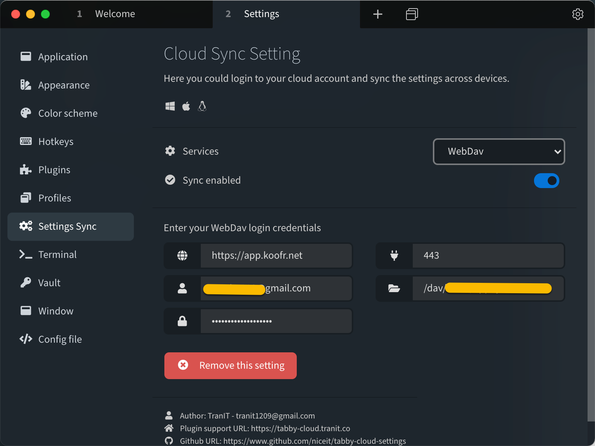
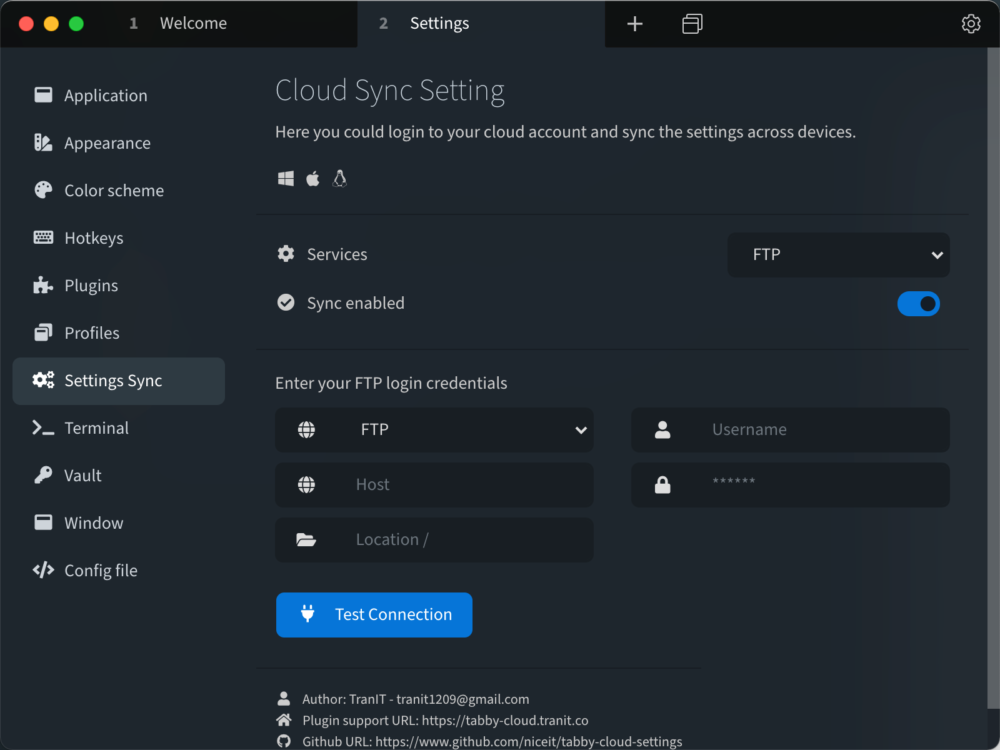
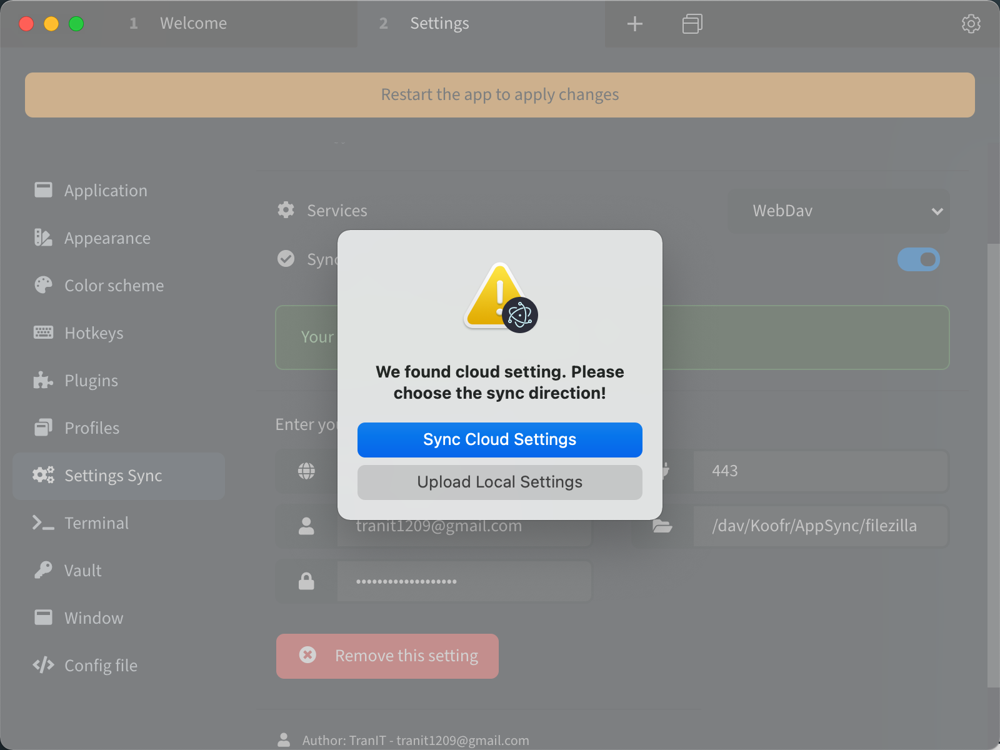

# Tabby Sync Cloud Settings

### Support for Tabby SSH https://github.com/Eugeny/tabby

   
   &nbsp;  
   
  

With this plugin you could sync your settings (Including saved SSH Sessions) automatically across devices.

Current platforms supported: **MacOS** **Windows** **Linux**

This plugin is **FREE** of use under public license MIT.

## Current supported Cloud Services

## Checkout some screenshots

Plugin support vary amount of cloud services. More clouds will be supported soon in the future.

Any feedback will be appreciated for next version releases.
Hope you will like this plugin for your productivity work.

Love the plugin? Buy me a coffee.

# Changelog
Keep tracking of version release change logs

## [v1.4.0] - 2022-05-22

- Auto sync support (Detect sync settings from other machine from cloud.)
- Critical bugs fix.
- Minor fixes and bugs.

## [v1.3.0] - 2021-12-21

- Support FTP / FTPs Port setting
- Add support for Gists (GitHub, GitLab)
- Backup the Tabby settings for first time sync.
- Minor fixes and bugs.

## [v1.2.2] - 2021-08-24

## Added

- Add support for [Blackblaze B2 Storage](https://www.backblaze.com/b2/cloud-storage.html).

## [v1.2.1] - 2021-08-21

## Added

- Add support for [Digital Ocean Space](https://www.digitalocean.com/products/spaces/).

## [v1.2.0] - 2021-08-19

## Added

- Add support for [Wasabi Cloud Storage](https://wasabi.com/).

## [v1.1.3] - 2021-08-14

### Fixes

- Add logger.
- Minor fixes and bugs.

## [v1.0.2] - 2021-08-07

### Fixes

- Optimize for security setting file encryption.
- Fixing bugs.

## [v1.0.0] - 2021-08-01

### Added

- Initial the plugin package
- Added Support for Amazon S3, FTP, WebDav
