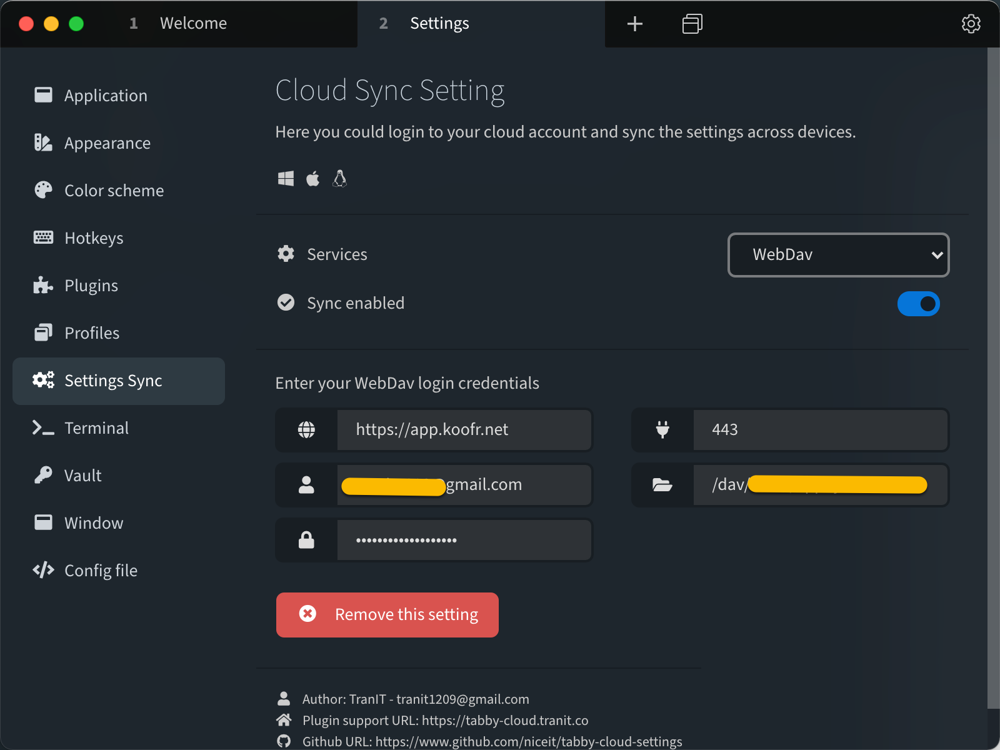
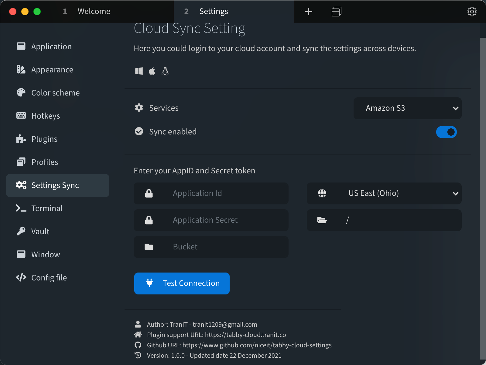
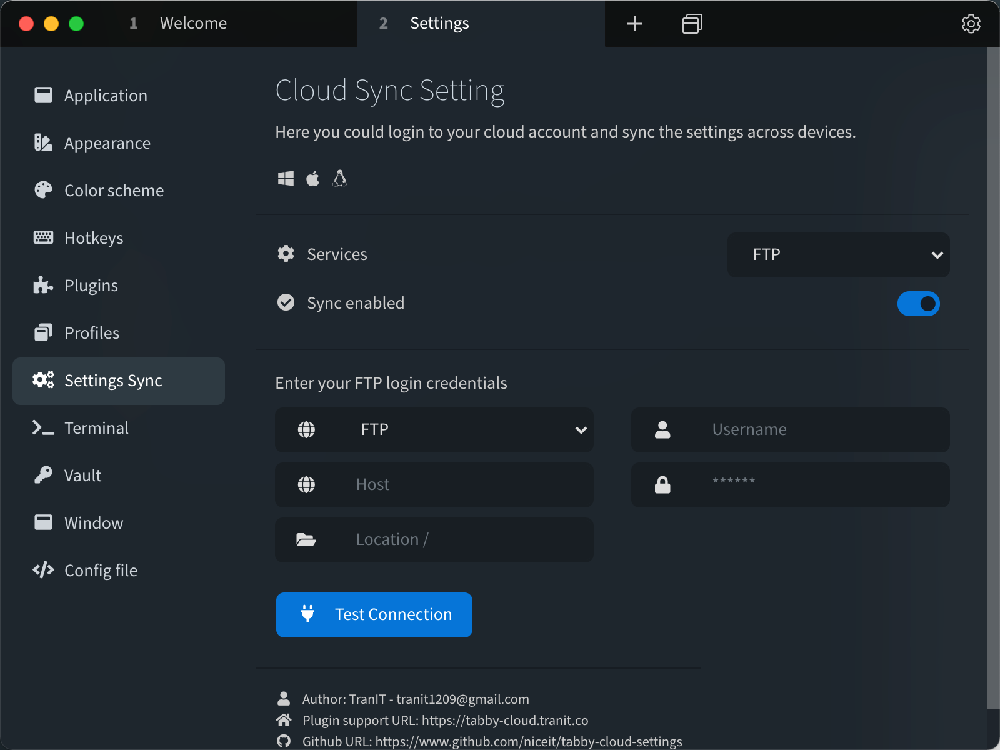
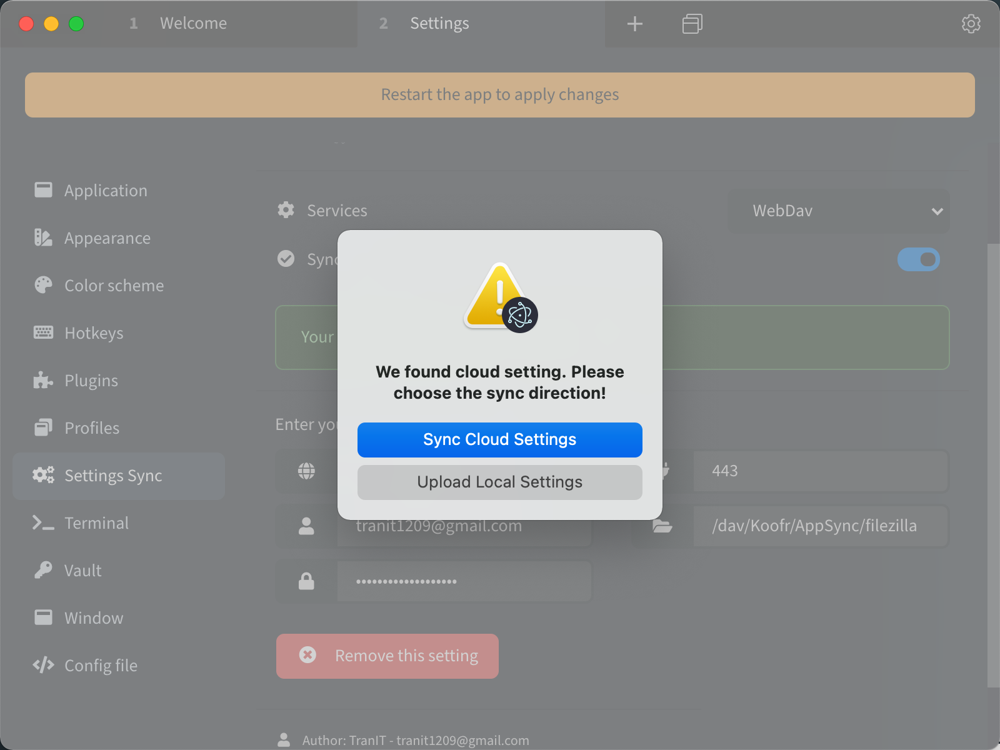

# Tabby Sync Cloud Settings

----

#### ❤️ If you love the project, please Sponsor it so I will have self-fund to keep it long live development. Thanks so much! ❤️

### Plugin for Tabby SSH https://github.com/Eugeny/tabby

<p align="center">
  <a href="https://www.npmjs.com/package/terminus-cloud-settings-sync"></a>
  <a href="https://tabby-sync.github.io/"></a> &nbsp;
  
  
  <a href="https://www.codefactor.io/repository/github/niceit/tabby-cloud-sync-settings"></a>
  
</p>

With this plugin you could sync your settings (Including saved SSH Sessions) automatically across devices.

Current platforms supported: **MacOS** **Windows** **Linux**

This plugin is **FREE** of use under public license MIT.

## Publishing

Dropbox OAuth uses PKCE, so published builds only need the Dropbox app key; do not embed the Dropbox app secret in the plugin.

Register this exact redirect URI in the Dropbox App Console under **OAuth 2 → Redirect URIs**:

```text
http://localhost:53682/dropbox/callback
```

During connection, the plugin temporarily listens on that loopback address, validates the OAuth `state`, completes the token exchange automatically, and then closes the listener. Manual callback paste remains available as a fallback if the local port cannot be opened.

Set `DROPBOX_APP_KEY` in the environment before building, watching, or publishing:

```sh
DROPBOX_APP_KEY=your_dropbox_app_key npm run build
DROPBOX_APP_KEY=your_dropbox_app_key npm run watch
DROPBOX_APP_KEY=your_dropbox_app_key npm publish
```

The environment variable belongs to the build/watch process, not the Tabby process. If a webpack watcher was started without `DROPBOX_APP_KEY`, stop it and restart it with the variable; otherwise each rebuild overwrites `dist/index.js` with an empty app key.

For GitHub Actions, store the value as a repository secret named `DROPBOX_APP_KEY` and expose it only to the publish step:

```yaml
- name: Publish package
  run: npm publish
  env:
    NODE_AUTH_TOKEN: ${{ secrets.NPM_TOKEN }}
    DROPBOX_APP_KEY: ${{ secrets.DROPBOX_APP_KEY }}
```

`prepublishOnly` fails when `DROPBOX_APP_KEY` is missing, preventing a release with Dropbox authentication disabled. The app key is compiled into `dist/index.js` and must be treated as public client metadata, not as a secret.

## Current supported Cloud Services

----


## Checkout some screenshots

----









Plugin support vary amount of cloud services. More clouds will be supported soon in the future.

Any feedback will be appreciated for next version releases.
Hope you will like this plugin for your productivity work.

### Love the plugin? Buy me a coffee.

----

[](https://donorbox.org/tabby-cloud-sync-settings-donation)

# Change logs

----

Keep tracking of version release change logs

## [v1.6.5] - 2024-10-14

- Dropbox official supported.
- Plugin logs supported.
- Optimize the sync feature.
- Fix known bugs
- UI Adjustments according to Tabby newer version.


## [v1.6.0] - 2023-02-17

- Fix WebDav init sync issue.
- Improve self checking for update.
- Add support for rollback to previous version.
- Sponsor list added.
- Minor bug fixes.

## [v1.5.2] - 2022-11-19

- Add custom config for setting interval syncing time.
- Added Check for update tab.
- Support check for update and inline update for the plugin.
- Minor bug fixes.

## [v1.5.1] - 2022-08-16

- Inline Feedback, change logs, donate button, and more.
- Improve UI for better user experience.
- Minor fixes and bugs.

## [v1.5.0] - 2022-07-17

- Official support for **S3 Compatibility Minio, and others...**
- Minor fixes and bugs.

## [v1.4.3] - ...

- Minor fixes and bugs.

## [v1.4.0] - 2022-05-22

- Auto sync support (Detect sync settings from other machine from cloud).
- Critical bugs fix.
- Minor fixes and bugs.

## [v1.3.0] - 2021-12-21

- Support FTP / FTPs Port setting
- Add support for Gists (GitHub, GitLab)
- Backup the Tabby settings for first time sync.
- Minor fixes and bugs.

## [v1.2.2] - 2021-08-24

## Added

- Add support for [Blackblaze B2 Storage](https://www.backblaze.com/b2/cloud-storage.html).

## [v1.2.1] - 2021-08-21

## Added

- Add support for [Digital Ocean Space](https://www.digitalocean.com/products/spaces/).

## [v1.2.0] - 2021-08-19

## Added

- Add support for [Wasabi Cloud Storage](https://wasabi.com/).

## [v1.1.3] - 2021-08-14

### Fixes

- Add logger.
- Minor fixes and bugs.

## [v1.0.2] - 2021-08-07

### Fixes

- Optimize for security setting file encryption.
- Fixing bugs.

## [v1.0.0] - 2021-08-01

### Added

- Initial the plugin package
- Added Support for Amazon S3, FTP, WebDav
