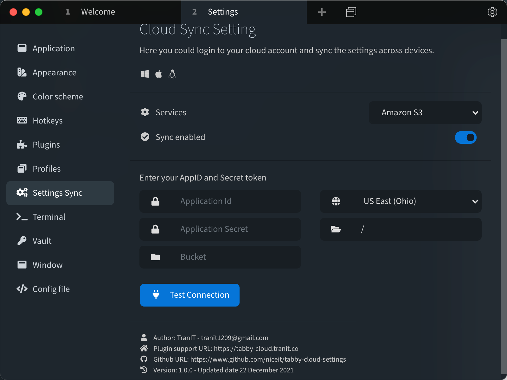

# Tabby Sync Cloud Settings

### Support for Tabby SSH https://github.com/Eugeny/tabby

With this plugin you could sync your settings (Including saved SSH Sessions) automatically across devices.

Current platforms supported: **MacOS** **Windows** **Linux**

This plugin is **FREE** of use under public license MIT.

Checkout some screenshots

Plugin support vary amount of cloud services. More clouds will be supported soon in the future.

Any feedback will be appreciated for next version releases.
Hope you will like this plugin for your productivity work.

Love the plugin? Buy me a coffee.

